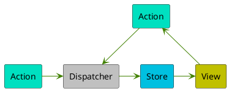

# @sugoroku-y/flux-esse

[](https://react.dev/)
[](https://github.com/immerjs/immer)
[](https://www.typescriptlang.org/)
[](https://developer.mozilla.org/en-US/docs/Web/JavaScript)
[](https://github.com/sugoroku-y/flux-esse/pkgs/npm/flux-esse)
[](./LICENSE)
[](https://coveralls.io/github/sugoroku-y/flux-esse?branch=main)
[](https://github.com/sugoroku-y/flux-esse/actions/workflows/publish.yml)
[](https://github.com/sugoroku-y/flux-esse/actions/workflows/coverage.yml)

useReducerとimmerを使ってFLUXアーキテクチャーの本質的な部分を実装するカスタムフックです。

## 特徴

FLUXアーキテクチャのエッセンシャルな部分、View、Action、Dispatcher、Storeの各要素で処理を循環させるという実装を実現させることが簡単にできます。


<!--



-->

[`useStoreAndActions`](api.md#usestoreandactions)には、引数としてStoreの実装、初期値と各Actionに対するハンドラーとしてのメソッドを実装したクラス、もしくはオブジェクトリテラルを指定し、StoreとActionを取得します。

[`createFluxEsseContext`](api.md#createfluxessecontext)も同様に、引数としてStoreを実装したクラス、もしくはオブジェクトリテラルを指定し、コンテキストを生成します。

生成したコンテキストからStoreとActionを取得するには[`useFluxEsseContext`](api.md#usefluxessecontext)を使用します。

## インストール

以下のコマンドでインストールしてください。

```bash
npm install sugoroku-y/flux-esse
```

yarnをご利用の場合は適宜読み替えてください。

## 利用方法

単体のコンポーネントで利用する場合と、複数のコンポーネントで利用する場合で使用するAPIが異なります。

### 単体のコンポーネントで利用する場合

1つのコンポーネントだけでFLUXアーキテクチャーを実現する場合は、[`useStoreAndActions`](api.md#usestoreandactions)を使います。

```tsx
function Component() {
  const [{ text }, { change }] = useStoreAndActions({
    text: 'initial',
    change(newText: string) {
      this.text = newText;
    },
  });
  return <div onClick={() => change('next')}>{text}</div>;
}
```

### 複数のコンポーネントから利用する場合

複数のコンポーネントで1つのStoreを共有する場合はコンテキストを使う[`createFluxEsseContext`](api.md#createfluxessecontext)/[`useFluxEsseContext`](api.md#usefluxessecontext)を使います。

```tsx
const SampleContext = createFluxEsseContext(
  class {
    count = 0;
    increment() {
      this.count += 1;
    }
    decrement() {
      this.count -= 1;
    }
  },
);

function Page() {
  return (
    <SampleContext.Provider>
      <IncrementButton />
      <CountView />
      <DecrementButton />
    </SampleContext.Provider>
  );
}

function IncrementButton() {
  const [, { increment }] = useFluxEsseContext(SampleContext);
  return <button onClick={() => increment()}>+</button>;
}

function CountView() {
  const [{ count }] = useFluxEsseContext(SampleContext);
  return <span>{count}</span>;
}

function DecrementButton() {
  const [, { decrement }] = useFluxEsseContext(SampleContext);
  return <button onClick={() => decrement()}>-</button>;
}
```

### API

詳しくは[API](api.md)を参照してください。

## Contributors

[蛭子屋双六](https://github.com/sugoroku-y)

## ライセンス

このプロジェクトはMITライセンスのもとで公開されています。詳細については、[LICENSE](LICENSE) を参照してください。
